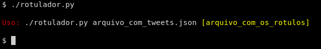
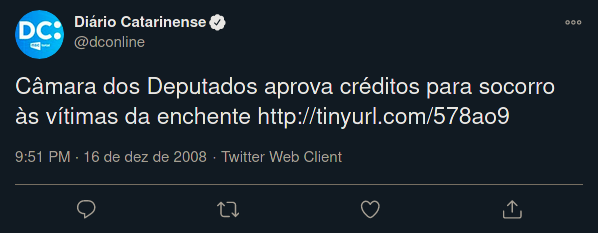
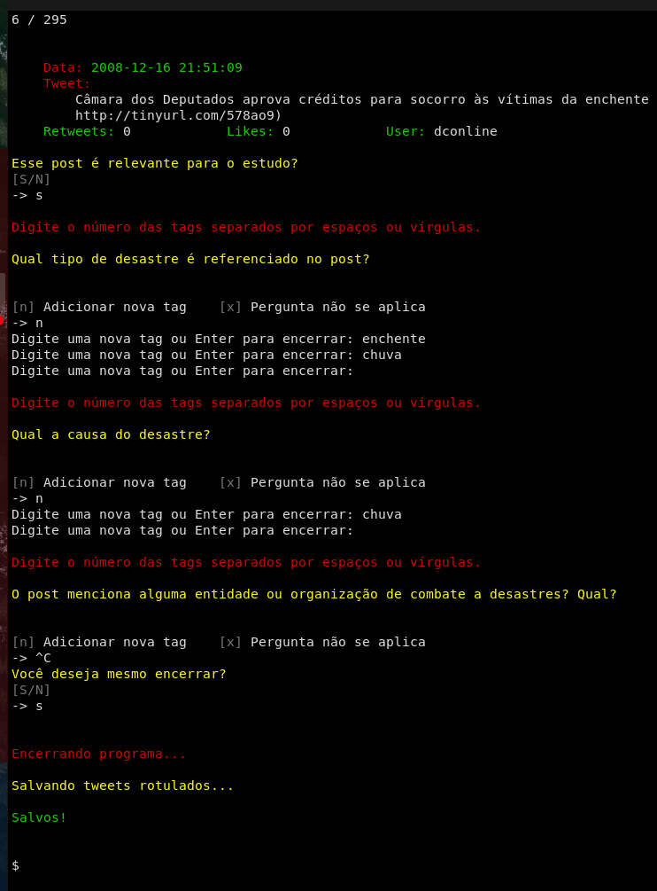

# RESILIENTools



## Motivação
Este ferramental foi criado pra coletar e rotular tweets relacionados a desastres naturais de maneira a dar um ponto adicional de análise para a tese de doutorado "*título da tese*", de __Rodolfo Strauss Nunes__. O objetivo foi automatizar a coleta de posts que pudessem ter relação com os desastres buscados para extrair dados que possibilitassem a análise da resiliência de diferentes municípios a destres naturais.

## Coleta de dados
Para a coleta inicial dos dados, fui utilizada a ferramenta [Twint](https://github.com/), criada para facilitar a extração de dados brutos do twitter sem depender da API disponibilizada pela rede social (e sofrer bloqueios pela limitação de requisições permitidas). Com base nela, foi criado um script (`query.sh`) em _bash_ para fazer chamadas à ferramenta passando parâmetros como a data do desastre, sua localidade e as palavras-chave a serem buscadas.

Após a execução da coleta, os posts ficam separados em pastas, com o nome da cidade, com arquivos `JSON`, nomeados com as datas dos desastres buscados, contendo todos os resultados encontrados para cada uma das palavras-chave no período do desastre.

Para melhor exemplificar a representação dos dados, o seguinte tweet



gera este objeto JSON
``` JSON
{
  "id": 1061713294,
  "conversation_id": "1061713294",
  "created_at": 1229471469000,
  "date": "2008-12-16",
  "time": "21:51:09",
  "timezone": "-03",
  "user_id": 13642662,
  "username": "dconline",
  "name": "Diário Catarinense",
  "place": "",
  "tweet": "câmara dos deputados aprova créditos para socorro às vítimas da enchente  http://tinyurl.com/578ao9",
  "mentions": [],
  "urls": [],
  "photos": [],
  "replies_count": 0,
  "retweets_count": 0,
  "likes_count": 0,
  "hashtags": [],
  "cashtags": [],
  "link": "https://twitter.com/dconline/status/1061713294",
  "retweet": false,
  "quote_url": "",
  "video": 0,
  "near": "",
  "geo": "",
  "source": "",
  "user_rt_id": "",
  "user_rt": "",
  "retweet_id": "",
  "reply_to": [
    {
      "user_id": "13642662",
      "username": "dconline"
    }
  ],
  "retweet_date": "",
  "translate": "",
  "trans_src": "",
  "trans_dest": ""
}
```

## Rotulamento dos posts
Para possibilitar o tratamento posterior dos posts a serem analisados, os posts recebem um novo campo de dados (`palavras_chave`) contendo os termos buscados presentes naquela postagem específica ao serem processados pelo programa `auto_rotulador.py`. Também pode se perguntar ao operador se o post é relevante ao estudo, de forma a reduzir o tamanho do conjunto de dados, e realizar uma revisão manual das tags aplicadas. Estas funções são tratadas pelo programa `rotulador_simples.py`.

Além disso, a ferramenta `rotulador.py` permite definir perguntas (contidas no arquivo `perguntas.json`) a serem respondidas por um operador humano capaz de interpretar o post, com suas possíveis imagens e links, de forma a criar campos personalizados e rótulos resposta. Infelizmente, devido ao grande volume de dados coletados, não foi viável realizar em tempo hábil esta forma de rotulamento para o estudo em questão.

## Interface


